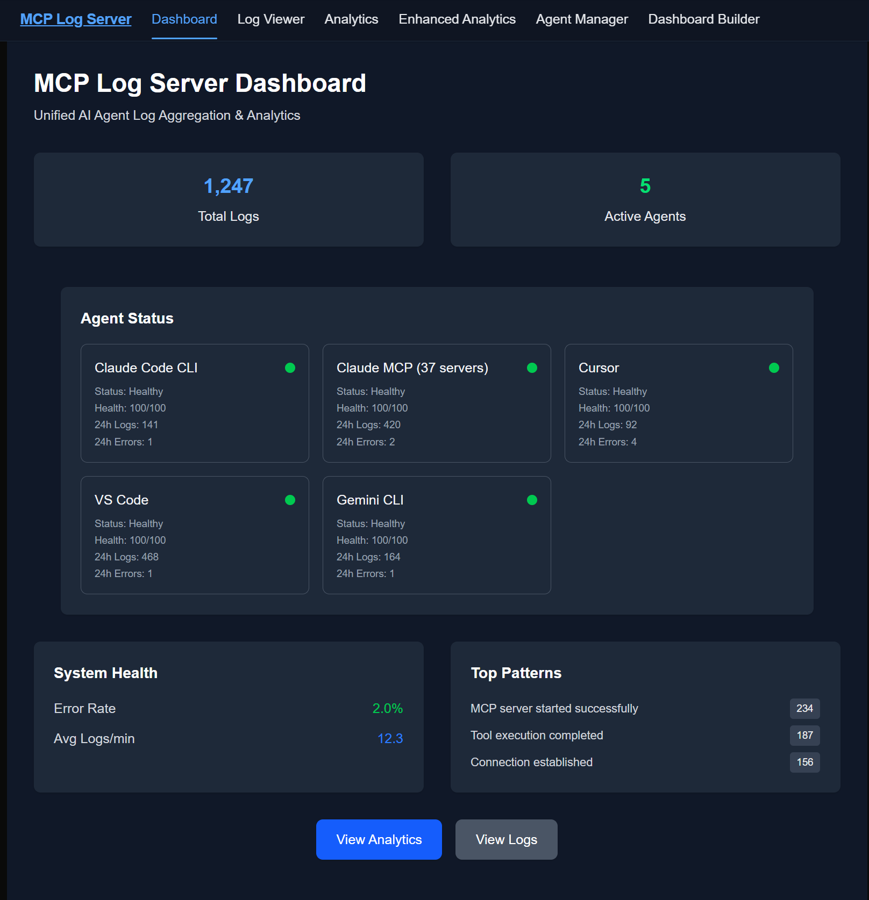
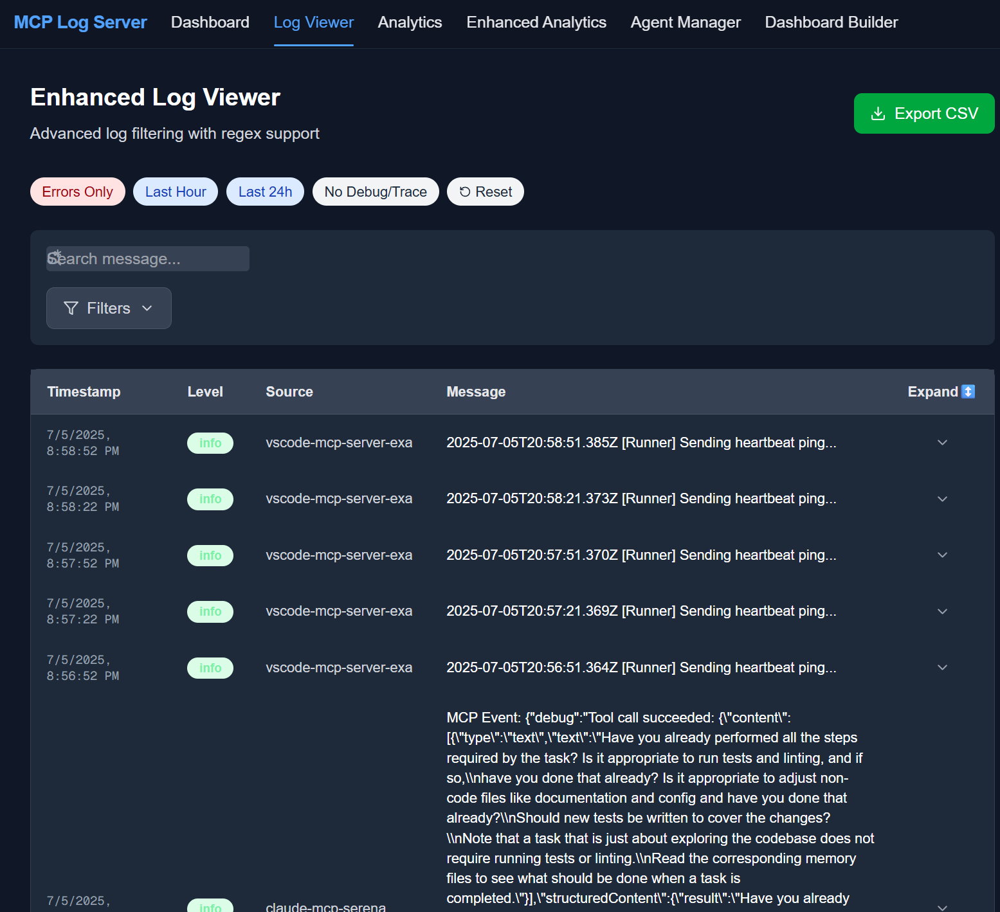
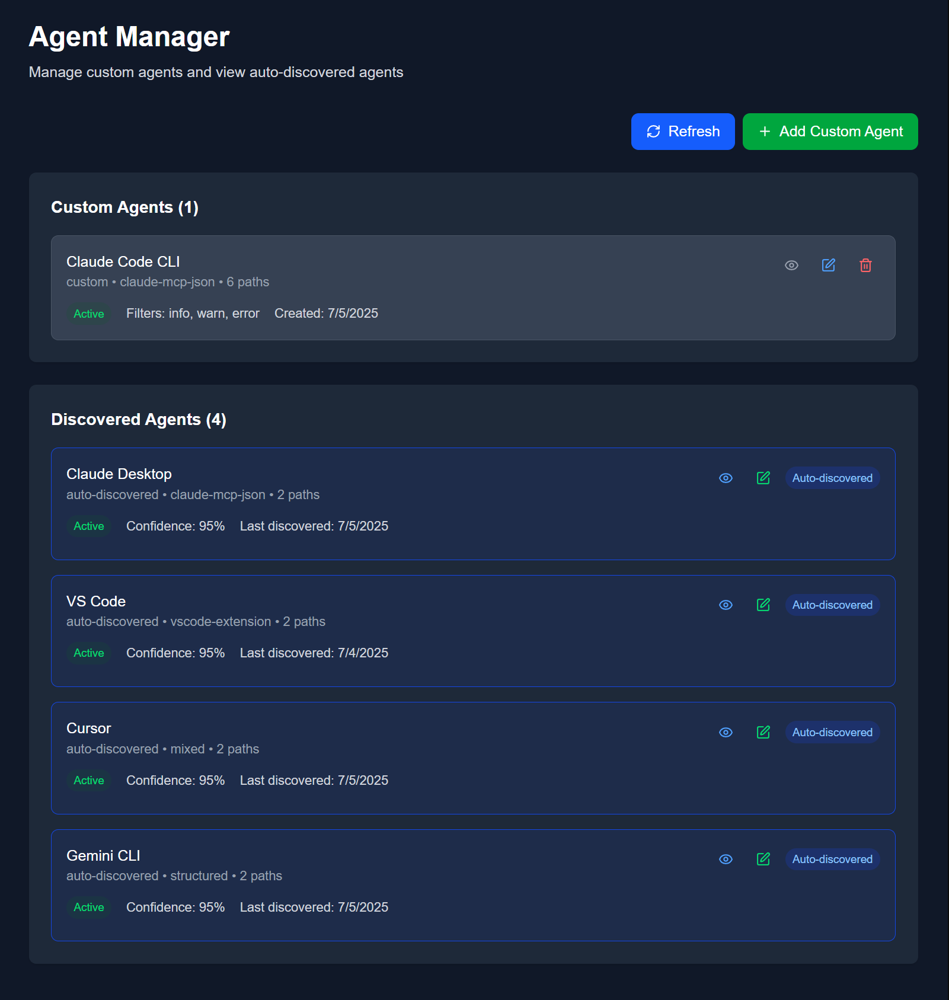
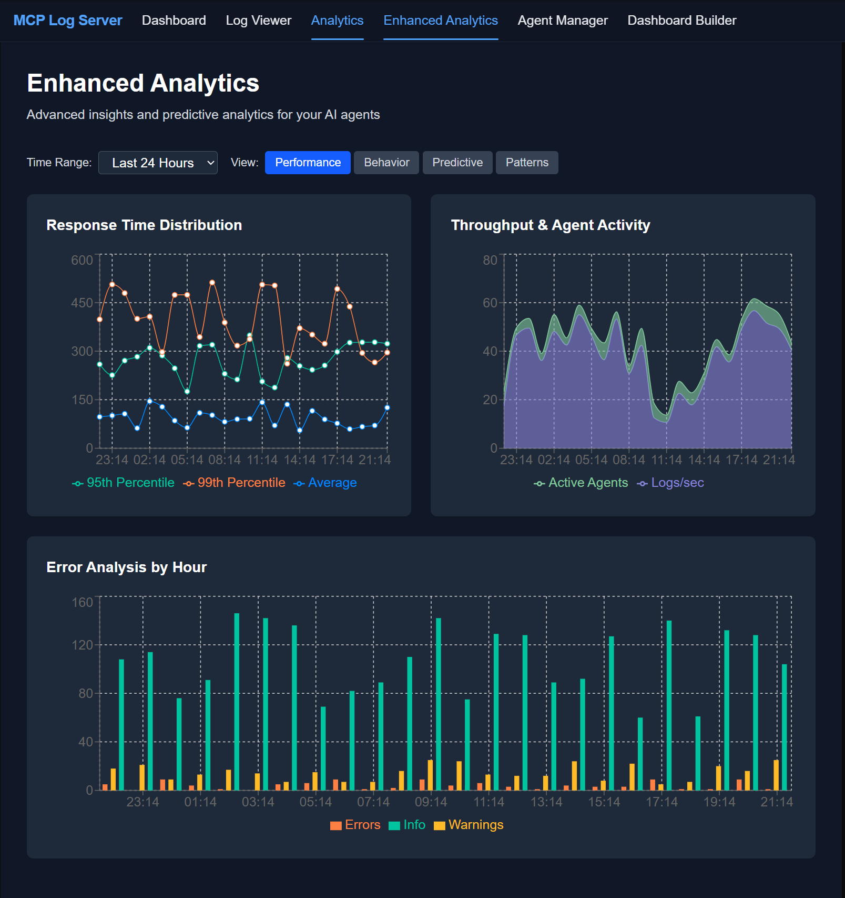

# MCP Log Server

> **AI Agent Log Aggregation & Monitoring Platform**

A comprehensive logging and monitoring platform designed for AI agent ecosystems. MCP Log Server automatically discovers, aggregates, and analyzes logs from various AI agents including Claude, Cursor, VS Code, Gemini CLI, and custom agents, providing real-time monitoring and analytics through a modern web dashboard.

[](https://www.typescriptlang.org/)
[](https://nextjs.org/)
[](https://www.fastify.io/)
[](https://www.postgresql.org/)
[](https://www.docker.com/)

## 🎯 What is MCP Log Server?

MCP Log Server is a monitoring and analytics solution that bridges the gap between AI agents and operational intelligence. It provides:

- **🔍 Cross-Platform Agent Discovery**: Automatically detects AI agents across Windows, macOS, Linux, and WSL environments
- **📊 Real-time Log Aggregation**: Collects logs from multiple agents with live updates via WebSocket connections
- **🧠 Basic Analytics**: Pattern detection and log analysis capabilities
- **🎨 Modern Dashboard**: Clean, responsive web interface with agent status and analytics
- **🔌 MCP Protocol Foundation**: Basic Model Context Protocol implementation for agent communication
- **⚙️ Custom Agent Management**: Add and configure custom log sources beyond auto-discovered agents
- **🚀 Production Ready**: Containerized architecture with multiple database support

## 🏗️ Architecture

### System Overview

```
┌─────────────────────────────────────────────────────────────────────────┐
│                           MCP Log Server Platform                        │
├─────────────────┬─────────────────┬─────────────────┬─────────────────┤
│   Agent Layer   │  Backend Layer  │ Database Layer  │ Frontend Layer  │
│                 │                 │                 │                 │
│ ┌─────────────┐ │ ┌─────────────┐ │ ┌─────────────┐ │ ┌─────────────┐ │
│ │ Claude CLI  │ │ │   Fastify   │ │ │ PostgreSQL  │ │ │   Next.js   │ │
│ │  Desktop    │◄├─┤   Server    │◄├─┤ (Metadata)  │ │ │  Dashboard  │ │
│ │   Cursor    │ │ │             │ │ │             │ │ │             │ │
│ │ VS Code     │ │ ├─────────────┤ │ ├─────────────┤ │ ├─────────────┤ │
│ │ Gemini CLI  │ │ │   Agent     │ │ │ ClickHouse  │ │ │ Real-time   │ │
│ │   Custom    │ │ │ Discovery   │ │ │   (Logs)    │ │ │   Updates   │ │
│ └─────────────┘ │ │  Service    │ │ │             │ │ │             │ │
│                 │ │             │ │ ├─────────────┤ │ ├─────────────┤ │
│ ┌─────────────┐ │ ├─────────────┤ │ │    Redis    │ │ │ WebSocket   │ │
│ │Log Sources: │ │ │ Log Watcher │ │ │  (Cache)    │ │ │   Client    │ │
│ │ • Text Logs │ │ │  Service    │ │ │             │ │ │             │ │
│ │ • Structured│ │ │             │ │ ├─────────────┤ │ └─────────────┘ │
│ │ • JSON Logs │ │ ├─────────────┤ │ │Elasticsearch│ │                 │
│ │ • Custom    │ │ │ WebSocket   │ │ │  (Search)   │ │                 │
│ └─────────────┘ │ │  Service    │ │ └─────────────┘ │                 │
│                 │ └─────────────┘ │                 │                 │
└─────────────────┴─────────────────┴─────────────────┴─────────────────┘
```

### Technology Stack

**Backend Infrastructure:**
- **Fastify** - High-performance web server with TypeScript support
- **PostgreSQL** - Primary database for agent configuration and metadata
- **ClickHouse** - Time-series database for log storage and analytics
- **Redis** - Caching layer and real-time data management
- **Elasticsearch** - Full-text search and log indexing

**Frontend Experience:**
- **Next.js 15** - React framework with App Router
- **Tailwind CSS** - Utility-first CSS framework
- **WebSocket Client** - Real-time updates and live monitoring

**Development & Operations:**
- **Turbo** - Monorepo build system for efficient development
- **TypeScript** - End-to-end type safety
- **pnpm** - Fast, disk space efficient package manager
- **Docker** - Containerized development and deployment

## 🚀 Installation (Interactive)

The project now includes an **interactive installation script** (`install.sh`) that lets you choose between Native and Docker installation modes:

```bash
chmod +x install.sh
./install.sh
```

You will be prompted to select:

- **Native Install**
  - Installs directly on your system (Node.js, npm, ClickHouse, etc.)
  - **Pros:** Direct file access, no Docker overhead
  - **Cons:** Requires dependencies on host, less isolated
- **Docker Install**
  - Runs everything in Docker containers (backend, frontend, ClickHouse, etc.)
  - **Pros:** Fully isolated, easy to deploy, consistent
  - **Cons:** Needs Docker, host file watching may need extra config

**Suggestions:**
- Use Native if you want direct integration with your OS and local files.
- Use Docker for easy, portable, and production-like deployments.

---

## 🐳 Docker Support

- Full `docker-compose.yml` provided for backend, frontend, and ClickHouse.
- Example for mounting host log directories for native file watching:
  ```yaml
  services:
    backend:
      # ...
      volumes:
        - ~/.cursor/logs:/host-cursor-logs:ro
      environment:
        - CURSOR_LOGS_PATH=/host-cursor-logs
  ```
- Environment variable support for log path configuration.

---

## 🔄 Unified Service Management

A single script, `restart-service.sh`, is provided to:
- Stop all services
- Verify services have stopped
- Start all services
- Verify all services have started
- Clean up ports and log files
- Provide robust health checks for backend and frontend

---

## ✨ Key Features (Updated)

### 🛰️ Syslog Forwarder Management
- Full CRUD (create, read, update, delete) for syslog forwarders via UI and API
- Supports UDP, TCP, and TCP-TLS protocols
- Filtering, metadata, and connection testing for forwarders
- Persistent storage and defensive serialization

### 📺 Enhanced Log Viewer (Updated)
- Robust mode switching between "Live" (WebSocket) and "Manual Pull" (paginated fetch)
- Reliable WebSocket disconnect logic
- Clean, production-ready UI (no debug panels)

---

## 🛠️ Backend Logging & Debugging (New)
- Debug logs for log watcher and syslog forwarder events
- Defensive error handling and logging for all major backend services

---

## 📸 Screenshots

> **Note**: Screenshot images are currently being added. The image files will be placed in `docs/images/screenshots/` directory. See [docs/images/screenshots/README.md](docs/images/screenshots/README.md) for details on required screenshot files.

### Main Dashboard
The central hub for monitoring all your AI agents with real-time metrics and status overview.



*Features: Real-time agent status, system health metrics, log volume tracking, and quick navigation to detailed views.*

### Enhanced Log Viewer
Advanced log filtering and viewing with regex support for deep log analysis.



*Features: Real-time log streaming, advanced filtering, search functionality, and export capabilities.*

### Agent Manager
Comprehensive agent management interface for both auto-discovered and custom agents.



*Features: Auto-discovery status, custom agent configuration, agent health monitoring, and log path management.*

### Enhanced Analytics
Advanced analytics dashboard with performance metrics and predictive insights.



*Features: Response time distribution, throughput analysis, error tracking, and agent activity patterns.*

## 🛠️ Development Guide

### Project Structure

```
mcp-log-server/
├── apps/
│   ├── server/                     # Fastify Backend Server
│   │   ├── src/
│   │   │   ├── config.ts          # Server configuration
│   │   │   ├── server.ts          # Main server setup
│   │   │   ├── services/          # Business logic services
│   │   │   │   ├── agent-discovery.ts    # Agent discovery service
│   │   │   │   ├── log-watcher.service.ts # Log monitoring service
│   │   │   │   ├── log-analytics.service.ts # Analytics processing
│   │   │   │   ├── websocket.service.ts    # WebSocket handling
│   │   │   │   └── database.service.ts     # Database abstraction
│   │   │   └── routes/            # API route handlers
│   │   │       └── agents.ts      # Agent management routes
│   │   └── migrations/            # Database migrations
│   │
│   ├── web/                       # Next.js Frontend Dashboard
│   │   ├── src/
│   │   │   ├── app/              # App Router pages
│   │   │   │   ├── page.tsx      # Main dashboard
│   │   │   │   ├── agents/       # Agent management pages
│   │   │   │   ├── analytics/    # Analytics dashboard
│   │   │   │   └── logs/         # Log explorer
│   │   │   ├── components/       # React components
│   │   │   └── hooks/           # Custom React hooks
│   │   └── public/              # Static assets
│   │
│   ├── client/                   # MCP Client Implementation
│   └── cli/                      # Command Line Interface
│
├── packages/
│   ├── types/                    # Shared TypeScript types
│   │   ├── agent.ts             # Agent-related types
│   │   └── mcp.ts               # MCP protocol types
│   ├── database/                # Database utilities and migrations
│   ├── mcp-protocol/            # MCP implementation
│   └── ui/                      # Shared UI components
│
├── docs/                        # Documentation
├── docker-compose.dev.yml       # Development environment
└── start-dev.sh                 # Development startup script
```

### Development Workflow

```bash
# Start development environment
pnpm start

# Run specific services
pnpm --filter server dev          # Backend only
pnpm --filter web dev             # Frontend only

# Database management
pnpm run db:setup                 # Start all databases
pnpm run db:reset                 # Reset databases

# Code quality
pnpm run typecheck               # Type checking
pnpm run lint                    # Linting
pnpm run format                  # Format code

# Testing
pnpm test                        # Run tests
pnpm build                       # Build all packages
```

### Adding New Features

1. **Backend Features**:
   - Add types in `packages/types/`
   - Implement service logic in `apps/server/src/services/`
   - Create API routes in `apps/server/src/routes/`

2. **Frontend Features**:
   - Create components in `apps/web/src/components/`
   - Add pages in `apps/web/src/app/`
   - Implement hooks in `apps/web/src/hooks/`

3. **Shared Features**:
   - Define types in `packages/types/`
   - Add utilities in appropriate packages

## 📚 API Usage Examples

### REST API (with `curl`)

#### **Health Check**
```bash
curl http://localhost:3001/health
```

#### **Get All Agents**
```bash
curl http://localhost:3001/api/agents
```

#### **Search Logs**
```bash
curl "http://localhost:3001/api/logs/search?query=error&limit=10"
```

#### **Create a Syslog Forwarder**
```bash
curl -X POST http://localhost:3001/api/syslog/forwarders \
  -H "Content-Type: application/json" \
  -d '{
    "name": "MySyslogServer",
    "host": "192.168.1.100",
    "port": 514,
    "protocol": "udp",
    "facility": 16,
    "severity": "info",
    "format": "rfc5424",
    "enabled": true
  }'
```

#### **Update a Syslog Forwarder**
```bash
curl -X PUT http://localhost:3001/api/syslog/forwarders/<forwarder_id> \
  -H "Content-Type: application/json" \
  -d '{"enabled": false}'
```

#### **Delete a Syslog Forwarder**
```bash
curl -X DELETE http://localhost:3001/api/syslog/forwarders/<forwarder_id>
```

#### **Test Syslog Connection**
```bash
curl -X POST http://localhost:3001/api/syslog/test-connection \
  -H "Content-Type: application/json" \
  -d '{"host": "192.168.1.100", "port": 514, "protocol": "udp"}'
```

---

### WebSocket API

#### **Connect and Subscribe (JavaScript Example)**
```js
const ws = new WebSocket('ws://localhost:3001/ws');
ws.onopen = () => {
  ws.send(JSON.stringify({
    type: 'subscribe',
    channels: ['logs', 'analytics', 'agents']
  }));
};
ws.onmessage = (event) => {
  const data = JSON.parse(event.data);
  if (data.type === 'log-entry') {
    console.log('New log:', data.data);
  }
};
```

#### **Ping/Pong Keepalive**
The server may send `{"type":"ping"}` messages. Respond with:
```js
ws.send(JSON.stringify({ type: 'pong', timestamp: new Date().toISOString() }));
```

#### **Sample WebSocket Message Types**
- `log-entry`: New log line (real-time)
- `analytics-update`: Analytics dashboard update
- `agent-status`: Agent status change
- `pattern-alert`: Pattern detection alert

---

**For a full list of endpoints and payloads, see the [API Documentation section above](#api-documentation).**

## 🚀 Deployment

### Development Deployment

```bash
# Quick development setup
pnpm start                      # Starts everything with hot reload

# Individual service management
pnpm --filter server dev        # Backend server only
pnpm --filter web dev          # Frontend dashboard only
```

### Production Deployment

1. **Environment Setup**
   ```bash
   # Set production environment variables
   cp .env.example .env.production
   # Edit .env.production with your production values
   
   # Build for production
   pnpm build
   ```

2. **Docker Production Deployment**
   ```bash
   # Start production stack with docker-compose
   docker-compose -f docker-compose.prod.yml up -d
   
   # Monitor logs
   docker-compose logs -f
   ```

### Monitoring & Maintenance

```bash
# Health checks
curl http://localhost:3001/health

# System status
curl http://localhost:3001/api/system/status

# Database maintenance
pnpm run db:reset               # Reset and restart databases
```

## 🔍 Troubleshooting

### Common Issues & Solutions

**🚨 Backend Server Won't Start**
```bash
# Check if databases are running
docker-compose -f docker-compose.dev.yml ps

# Restart databases if needed
pnpm run db:reset

# Check port availability
lsof -i :3001
```

**🚨 Frontend Can't Connect to Backend**
```bash
# Verify backend health
curl http://localhost:3001/health

# Check CORS configuration in .env
cat .env | grep FRONTEND_URL
```

**🚨 Agent Discovery Not Working**
```bash
# Check agent installation paths
ls -la ~/.cache/claude-cli-nodejs/
ls -la ~/.vscode/logs/

# Test WSL mount points (if using WSL)
ls -la /mnt/c/Users/$USER/AppData/Roaming/Claude/
```

**🚨 Database Connection Issues**
```bash
# PostgreSQL connection test
psql -h localhost -U mcp_user -d mcp_log_server -c "SELECT 1;"

# ClickHouse connection test
curl http://localhost:8123/ping

# Redis connection test
redis-cli ping
```

### Debug Mode

Enable comprehensive debugging:

```bash
# Enable debug mode
DEBUG=true LOG_LEVEL=debug pnpm start

# Backend-specific debugging
DEBUG=server:* pnpm --filter server dev
```

### Log Analysis

Development logs are automatically created:
- **Backend**: `./backend.log`
- **Frontend**: Browser developer console
- **Database**: Check Docker Compose logs
- **Agent Discovery**: Available in dashboard and backend logs

## 🤝 Contributing

We welcome contributions! Here's how to get started:

### Development Environment Setup

1. **Fork and Clone**
   ```bash
   git clone https://github.com/yourusername/mcp-log-server.git
   cd mcp-log-server
   ```

2. **Setup Development Environment**
   ```bash
   pnpm install
   pnpm run db:setup
   pnpm start
   ```

3. **Create Feature Branch**
   ```bash
   git checkout -b feature/your-feature-name
   ```

### Contribution Guidelines

- **Code Style**: Follow ESLint and Prettier configurations
- **Testing**: Add tests for new features and bug fixes
- **Documentation**: Update relevant documentation
- **Commits**: Use conventional commit format
- **Pull Requests**: Provide clear description and context

### Areas for Contribution

- 🔌 **New Agent Integrations**: Add support for additional AI agents
- 📊 **Enhanced Analytics**: Improve pattern detection and analytics
- 🎨 **UI/UX Improvements**: Enhance dashboard design and usability
- 🚀 **Performance Optimizations**: Database and query optimizations
- 🧪 **Testing**: Improve test coverage
- 📚 **Documentation**: Expand guides and API documentation

## 📄 License

This project is licensed under the MIT License - see the [LICENSE](LICENSE) file for details.

## 🙏 Acknowledgments

- Built with modern web technologies for reliability and performance
- Inspired by the need for unified AI agent monitoring
- Community contributions and feedback are welcome

---

**Ready to monitor your AI agents?** 

```bash
git clone https://github.com/akamalov/mcp-log-server.git
cd mcp-log-server
pnpm install && pnpm start
```

Open [http://localhost:3000](http://localhost:3000) to get started! 🚀