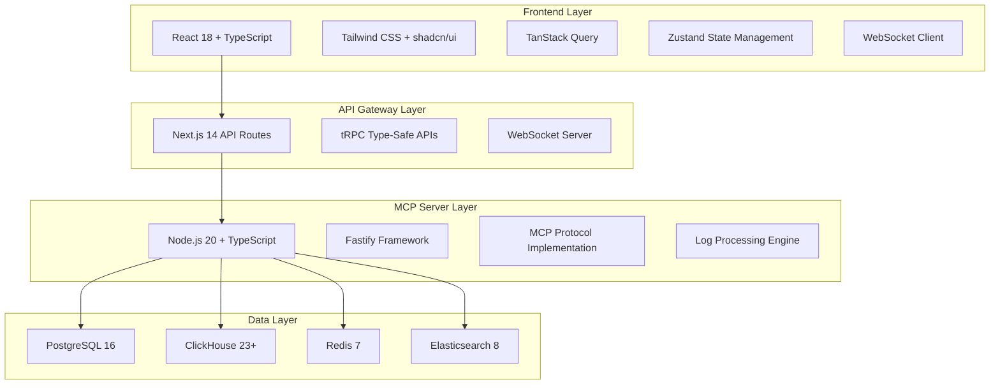

# Modern Technology Stack for MCP Log Server with Web UI

## Executive Summary

This document outlines a modern, scalable technology stack for building the MCP Log Server with a dynamic web interface. The stack is designed to handle real-time log processing, provide excellent developer experience, and deliver a responsive user interface while maintaining MCP protocol compliance.

## 🏗️ Architecture Overview

The MCP Log Server requires a modern, scalable stack that can handle:
- Real-time log ingestion from multiple AI agents
- MCP protocol compliance (JSON-RPC 2.0)
- Dynamic web interface with live updates
- Cross-platform compatibility
- High-performance search and analytics



## 🚀 Recommended Technology Stack

### **Backend Framework: Node.js 20+ with TypeScript**

**Primary Framework: Fastify 4+**
```typescript
import Fastify from 'fastify';
import websocket from '@fastify/websocket';

const server = Fastify({
  logger: { level: 'info' }
});

// WebSocket for real-time log streaming
await server.register(websocket);

// MCP Protocol endpoint
server.post('/mcp', async (request, reply) => {
  const mcpMessage = request.body as MCPMessage;
  return await mcpHandler.process(mcpMessage);
});
```

**Why Fastify over Express:**
- 2-3x faster performance
- Built-in TypeScript support  
- Native JSON schema validation
- Plugin architecture ideal for MCP extensibility
- Better async/await handling

### **Frontend: Next.js 14 + React 18**

**Modern Frontend Stack:**
```typescript
// Real-time log streaming component
export function LogStream() {
  const { logs, isConnected } = useLogStream();
  const deferredLogs = useDeferredValue(logs);

  return (
    <div className="h-full flex flex-col">
      <div className="flex items-center gap-2 p-4">
        <ConnectionStatus connected={isConnected} />
        <span>Real-time Log Stream</span>
      </div>
      <VirtualizedLogList logs={deferredLogs} />
    </div>
  );
}
```

**Key Features:**
- Next.js 14 App Router for modern routing
- Server Components for better performance
- React 18 concurrent features (Suspense, useDeferredValue)
- Built-in optimization for images, fonts, scripts

### **UI Framework: Tailwind CSS + shadcn/ui**

```typescript
// Modern, accessible log entry component
export function LogEntry({ entry }: { entry: MCPLogEntry }) {
  return (
    <Card className="p-4 hover:bg-muted/50 transition-colors">
      <div className="flex items-start justify-between">
        <Badge variant={getVariantForLevel(entry.level)}>
          {entry.level}
        </Badge>
        <time className="text-xs text-muted-foreground">
          {formatTimestamp(entry.timestamp)}
        </time>
      </div>
      <p className="mt-2 text-sm">{entry.message}</p>
    </Card>
  );
}
```

**Benefits:**
- Copy-paste components (no npm bloat)
- Fully customizable and accessible
- Excellent TypeScript support
- Consistent design system

### **Type-Safe APIs: tRPC**

```typescript
// End-to-end type safety
export const logsRouter = createTRPCRouter({
  getAll: publicProcedure
    .input(z.object({
      level: z.enum(['debug', 'info', 'warning', 'error']).optional(),
      source: z.string().optional(),
      limit: z.number().min(1).max(1000).default(100),
    }))
    .query(async ({ input }) => {
      return await logService.getLogs(input);
    }),

  search: publicProcedure
    .input(searchSchema)
    .query(async ({ input }) => {
      return await searchService.search(input.query, input.filters);
    }),
});
```

### **State Management**

**Server State: TanStack Query v5**
```typescript
export function useLogStream() {
  const queryClient = useQueryClient();
  
  const { data: logs } = useQuery({
    queryKey: ['logs'],
    queryFn: fetchRecentLogs,
    staleTime: 0,
  });

  const { isConnected } = useWebSocket({
    url: '/api/ws/logs',
    onMessage: (newLog) => {
      queryClient.setQueryData(['logs'], (old = []) => 
        [newLog, ...old.slice(0, 999)]
      );
    },
  });

  return { logs: logs || [], isConnected };
}
```

**Client State: Zustand**
```typescript
export const useLogStore = create<LogStore>()(
  devtools((set) => ({
    filters: { level: 'all', timeRange: '1h' },
    selectedSources: [],
    searchQuery: '',
    setFilters: (filters) => set({ filters }),
    setSelectedSources: (sources) => set({ selectedSources: sources }),
    setSearchQuery: (query) => set({ searchQuery: query }),
  }))
);
```

## 📊 Data Layer Architecture

### **Primary Database: PostgreSQL 16+**
- Configuration and metadata storage
- User sessions and authentication
- Plugin configurations

### **Time-Series Data: ClickHouse 23+**
```sql
CREATE TABLE logs (
    id UUID,
    timestamp DateTime64(3, 'UTC'),
    level Enum8('debug'=1, 'info'=2, 'warning'=4, 'error'=5),
    source LowCardinality(String),
    message String,
    
    -- MCP-specific fields
    mcp_method LowCardinality(String),
    correlation_id Nullable(String),
    session_id Nullable(String),
    
    -- AI Agent context
    agent_type LowCardinality(String),
    model_name LowCardinality(String),
    workspace_path Nullable(String)
    
) ENGINE = MergeTree()
PARTITION BY toYYYYMM(timestamp)
ORDER BY (timestamp, source, level);
```

### **Caching & Real-time: Redis 7+**
```typescript
// Pub/Sub for real-time updates
export class LogPubSub {
  async publish(channel: string, log: MCPLogEntry) {
    await redis.publish(channel, JSON.stringify(log));
  }

  subscribe(channel: string, callback: (log: MCPLogEntry) => void) {
    redis.subscribe(channel);
    redis.on('message', (channel, message) => {
      const log = JSON.parse(message);
      callback(log);
    });
  }
}
```

### **Search Engine: Elasticsearch 8+**
```typescript
export class SearchService {
  async search(query: string, filters?: SearchFilters) {
    const result = await elasticsearch.search({
      index: 'mcp-logs',
      body: {
        query: {
          bool: {
            must: [{
              multi_match: {
                query,
                fields: ['message^2', 'details.*', 'logger'],
              }
            }],
            filter: this.buildFilters(filters),
          }
        },
        sort: [{ timestamp: { order: 'desc' } }],
      },
    });

    return result.body.hits.hits.map(hit => hit._source);
  }
}
```

## 🔄 Real-Time Communication

### **WebSocket Implementation**
```typescript
// Server-side WebSocket
export async function setupWebSocket(fastify: FastifyInstance) {
  fastify.get('/ws/logs', { websocket: true }, (connection) => {
    const subscription = logStream.subscribe((log: MCPLogEntry) => {
      if (connection.readyState === WebSocket.OPEN) {
        connection.send(JSON.stringify({
          type: 'log_entry',
          data: log,
          timestamp: new Date().toISOString(),
        }));
      }
    });

    connection.on('close', () => subscription.unsubscribe());
  });
}

// Client-side WebSocket hook
export function useWebSocket({ url, onMessage }) {
  const [isConnected, setIsConnected] = useState(false);

  useEffect(() => {
    const ws = new WebSocket(`ws://localhost:3000${url}`);
    
    ws.onopen = () => setIsConnected(true);
    ws.onclose = () => setIsConnected(false);
    ws.onmessage = (event) => {
      const message = JSON.parse(event.data);
      onMessage(message.data);
    };

    return () => ws.close();
  }, [url, onMessage]);

  return { isConnected };
}
```

## 🐳 Development & Deployment

### **Monorepo Structure with pnpm**
```
mcp-log-server/
├── apps/
│   ├── web/              # Next.js frontend
│   ├── server/           # MCP server backend
│   └── cli/              # CLI tools
├── packages/
│   ├── mcp-protocol/     # MCP implementation
│   ├── ui/               # Shared components
│   ├── database/         # DB schemas
│   └── types/            # Shared types
└── docker/
```

### **Docker Containerization**
```dockerfile
FROM node:20-alpine AS base
RUN corepack enable pnpm

FROM base AS deps
WORKDIR /app
COPY package.json pnpm-lock.yaml ./
RUN pnpm install --frozen-lockfile

FROM base AS build
WORKDIR /app
COPY . .
COPY --from=deps /app/node_modules ./node_modules
RUN pnpm build

FROM base AS runtime
WORKDIR /app
COPY --from=build /app/dist ./dist
COPY --from=deps /app/node_modules ./node_modules

EXPOSE 3000 3001
CMD ["node", "dist/server.js"]
```

## 🧪 Testing Strategy

### **Unit Tests: Vitest**
```typescript
describe('MCP Protocol', () => {
  it('should handle log messages correctly', async () => {
    const server = new MCPServer();
    const message = createMockMCPMessage();
    
    const result = await server.handleMessage(message);
    expect(result).toBeDefined();
  });
});
```

### **E2E Tests: Playwright**
```typescript
test('real-time log streaming', async ({ page }) => {
  await page.goto('/');
  
  // Check connection status
  await expect(page.locator('[data-testid="connection-status"]'))
    .toHaveClass(/connected/);
  
  // Verify log appears
  await expect(page.locator('[data-testid="log-entry"]'))
    .toContainText('Test log message');
});
```

## 🔐 Security & Performance

### **Authentication**
```typescript
import jwt from 'jsonwebtoken';

export async function authenticateToken(request, reply) {
  const token = request.headers.authorization?.replace('Bearer ', '');
  
  if (!token) {
    return reply.status(401).send({ error: 'Access token required' });
  }

  try {
    const user = jwt.verify(token, process.env.JWT_SECRET);
    request.user = user;
  } catch (error) {
    return reply.status(403).send({ error: 'Invalid token' });
  }
}
```

### **Performance Optimizations**
```typescript
// Frontend: Virtualized lists for large datasets
import { FixedSizeList as List } from 'react-window';

export function VirtualizedLogList({ logs }) {
  return (
    <List
      height={600}
      itemCount={logs.length}
      itemSize={80}
      overscanCount={5}
    >
      {({ index, style }) => (
        <div style={style}>
          <LogEntry entry={logs[index]} />
        </div>
      )}
    </List>
  );
}

// Backend: Connection pooling and caching
export class OptimizedLogService {
  private cache = new LRU({ max: 1000, ttl: 5 * 60 * 1000 });

  async getLogs(filters: LogFilters) {
    const cacheKey = JSON.stringify(filters);
    const cached = this.cache.get(cacheKey);
    if (cached) return cached;

    const result = await this.db.query(buildLogQuery(filters));
    this.cache.set(cacheKey, result);
    return result;
  }
}
```

## 📈 Monitoring & Observability

### **Health Checks & Metrics**
```typescript
// Health endpoints
server.get('/health', async () => ({
  status: 'healthy',
  timestamp: new Date().toISOString(),
  uptime: process.uptime(),
}));

server.get('/ready', async () => {
  const dbHealth = await checkDatabase();
  const redisHealth = await checkRedis();
  
  return {
    status: dbHealth && redisHealth ? 'ready' : 'not ready',
    services: { database: dbHealth, redis: redisHealth }
  };
});

// Prometheus metrics
import prometheus from 'prom-client';

export const logProcessingRate = new prometheus.Counter({
  name: 'logs_processed_total',
  help: 'Total logs processed',
  labelNames: ['source', 'level'],
});
```

## 🎯 Key Benefits of This Stack

### **✅ Modern & Performant:**
- Latest stable versions of all technologies
- Type safety end-to-end with TypeScript + tRPC
- Real-time updates with optimized WebSocket implementation
- Virtualized rendering for handling large datasets

### **✅ Developer Experience:**
- Hot reload and fast builds with Vite/Next.js
- Comprehensive testing suite (unit, integration, E2E)
- Excellent debugging tools and error handling
- Monorepo structure for code sharing

### **✅ Production Ready:**
- Horizontal scaling with containerization
- Comprehensive monitoring and health checks
- Security best practices (JWT, rate limiting, input validation)
- Performance optimizations (caching, connection pooling)

### **✅ MCP Protocol Optimized:**
- Native JSON-RPC 2.0 support
- Cross-platform compatibility
- Plugin architecture for extensibility
- Real-time log processing pipeline

This stack provides a solid foundation for building a modern, scalable MCP Log Server with an excellent web interface that can compete with enterprise-grade logging solutions while maintaining the flexibility needed for the diverse AI agent ecosystem. 